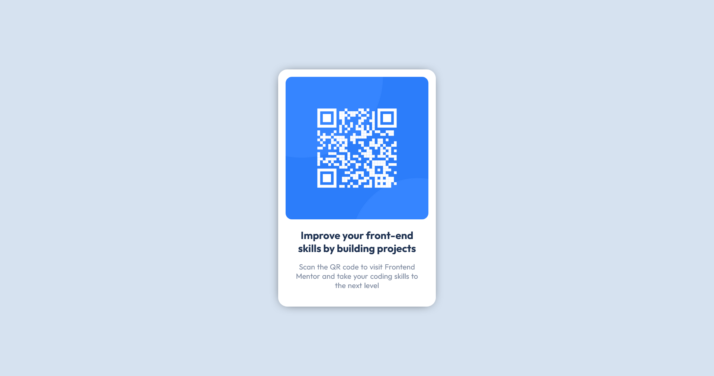

<h1 style="text-align:center;">QR - Code Component Challenge</h1>

---

## About the challenge

---

This would be my first challenge from [frontendmentor.io](https://www.frontendmentor.io), this challenge can be a perfect example of how a basic webpage can be build i.e., can be as easy as possible with only HTML, CSS or as complex as possible with any of the frameworks etc.

## Links

[Live URL](https://lazzyy.github.io/QR-code-component-frontendmentor)

## Built With

---

- Semantic HTML5 markup
- CSS custom properties
- Flexbox

## What I learned

---

A good first timer project who recently entered web development. Mozilla Firefox browser is OP (Has the Measure values feature) but still some might prefer figma or pixel perfect if you could afford.
